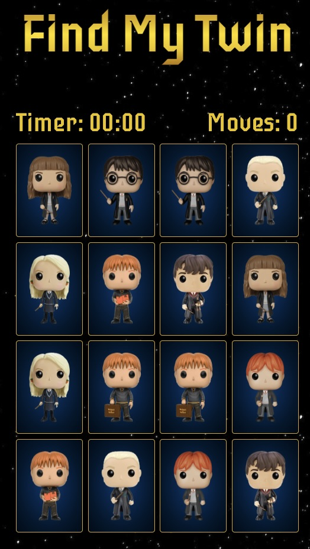
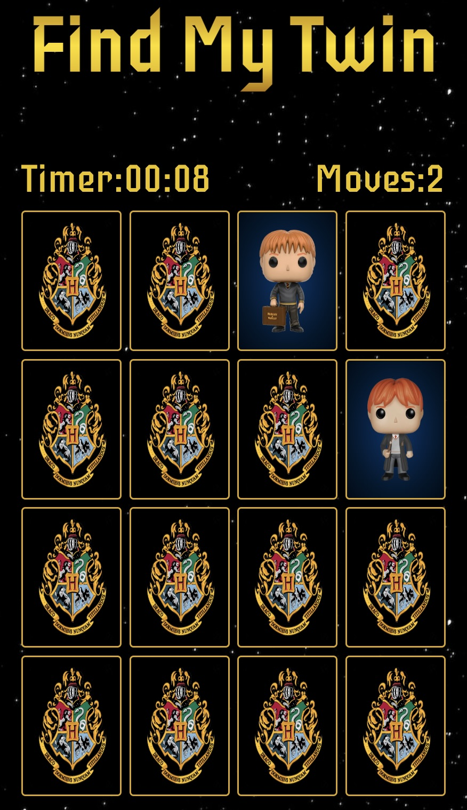

# Find My Twin
### Find my Twin is a card matching game where the player find the matching cards as soon as possible while flipping the least amount of cards.
### When the game starts the cards will be face up for a couple of seconds before they are flipped back.  

## The timer and the moves counter will only start when the fist card is flipped.

### Once all the twins are found the game is over. 
## Lets see how fast you can find the twins! 
# Technologies Used:
## This game was made using, HTML, CSS and Javascript. Images were taken from the website: harrypotterpopvinyls.com